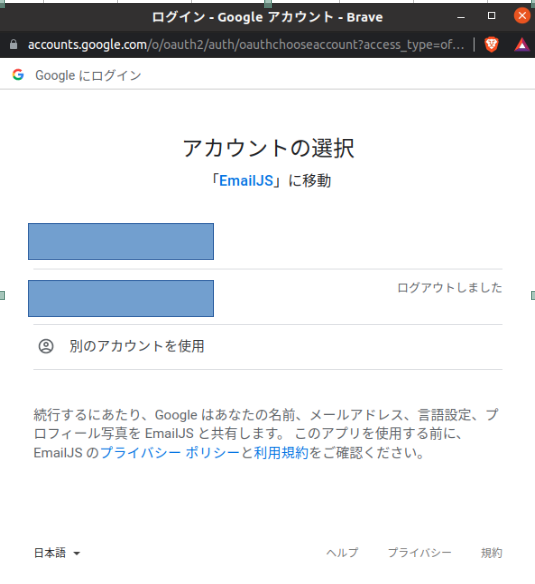

# EmailJS


とりあえず結論からいうと preventDefault(); がform送信時の処理内にかかれていないのではと予想してます。

(自分も当初上手く送信されなかったのでデバッグした所、上記が原因で送信が出来てなかっただけでした。)


EmailJSの設定情報、コード自体にも誤りがないのにメール送信が上手くいっていなかったのであれば結構濃厚だと思います。


現状のコードのどの部分にpreventDefault(); を書けばいいか調べて試してみても良いと思いますし、

一応自分の環境で上手く行った手順を以降につらつらと書いてますので

参照しながら最初からやり直してみてもいいかもです！


### EmailJSのアカウント登録からテストmail送信まで


- 「Add New Service」をクリック


- 「Gmail」をクリック


- 「Connect Account」をクリック


- 使用するGoogleアカウントを選択




- 「ユーザー本人に代わってメールを送信 です。」も必ずチェック！！その後「続行」をクリック

  

  

  

- 「Create Service」をクリック


- 以下のようにGmailがServiceとして追加されるので三点リーダー「・・・(縦)」をクリック


- 「Test Service」をクリック


- 「Send the Test Email」をクリックしてテストメールを送信


- 200 OK がResponseに返ってきてればOK


- 念の為本当に届いているかを確認


### Templateを設定


- サイドメニューの「Email Tempates」をクリック


- 「Create New Tempate」をクリックすると以下の画面となる


- 以下のように content 部分のみ任意の値に書き換えてから「Save」をクリック

※他はデフォルト設定のまま(変えたかったら全部うまくいった後にご自分で調整しながら変えてください。)


(上記キャプチャ content 部分のコピペ用)

```text
こんにちは 、

{{from_name}} : ({{email}}) から新しいメッセージが届きました

{{message}}

幸運をお祈りしています!!
EmailJS team
```


### JavaScriptから送信してみる


- Desktop配下に「EmailJS」フォルダを作成してVSCodeで開く(本当はどこでも良いし名前も何でも良いです笑)


以下のようにVSCodeで開くとEXPLORERの表示上は大文字になっているが気にしない


- 直下にindex.htmlを作成


index.htmlのコードは以下

```html
<!DOCTYPE html>
<html lang="ja">

<head>
  <meta charset="UTF-8">
  <meta http-equiv="X-UA-Compatible" content="IE=edge">
  <meta name="viewport" content="width=device-width, initial-scale=1.0">
  <link href="https://cdn.jsdelivr.net/npm/bootstrap@5.0.2/dist/css/bootstrap.min.css" rel="stylesheet"
    integrity="sha384-EVSTQN3/azprG1Anm3QDgpJLIm9Nao0Yz1ztcQTwFspd3yD65VohhpuuCOmLASjC" crossorigin="anonymous">
  <title>Document</title>
</head>

<div class="container mt-5">
  <h1>Test Mail</h1>
  <form class="my-5" id="form" novalidate>
    <div class="mb-3">
      <label for="email" class="form-label">Email address</label>
      <input type="email" class="form-control" id="email" placeholder="name@example.com">
    </div>
    <div class="mb-3">
      <label for="name" class="form-label">Your Name</label>
      <input class="form-control" id="name" rows="3"></input>
    </div>
    <div class="mb-3">
      <label for="message" class="form-label">Example textarea</label>
      <textarea class="form-control" id="message" rows="3"></textarea>
    </div>
    <button class="btn btn-success" id="sendMailButton">Email sending test !!</button>
  </form>
</div>

<body>
  <!-- EmailJSを使えるようにCDNを取得 -->
  <script src="https://cdn.jsdelivr.net/npm/@emailjs/browser@3/dist/email.min.js"></script>

  <script>
    // EmailJS使用前の初期化処理
    (function () {
      emailjs.init("YOUR_PUBLIC_KEY");
    })();

    // formの値をTemplateに渡すパラメータにセット
    function templateVariablesSet(argEmail, argName, argMessage) {
      let obj = {
        email: argEmail,
        from_name: argName,
        message: argMessage,
      }
      return obj;
    };

    // triggerとなるHTMLの要素を取得
    const sendMailButton = document.getElementById('sendMailButton');

    // triggerとなるボタンを押下した際にメール送信処理を呼び出すようにEventListenerに登録しておく
    sendMailButton.addEventListener('click', event => {
      event.preventDefault(); // もしかしたらデフォルトの動作を止めるこの処理が抜けてるのが一番の原因かも？？
      let argEmail = document.getElementById('email').value;
      let argName = document.getElementById('name').value;
      let argMessage = document.getElementById('message').value;

      templateVariables = templateVariablesSet(argEmail, argName, argMessage);

      emailjs.send('YOUR_SERVICE_ID', 'YOUR_TEMPLATE_ID', templateVariables)
        .then(function (response) {
          alert('SUCCESS!');
          console.log('SUCCESS!', response.status, response.text);
        }, function (error) {
          alert('FAILED...');
          console.log('FAILED...', error);
        });
    });
  </script>

</body>

</html>
```


- 以下1. 2. 3. の箇所を自分の情報に書き換える

1. YOUR_PUBLIC_KEY (39行目)
2. YOUR_SERVICE_ID (64行目)
3. YOUR_TEMPLATE_ID (64行目)


参考)

1. ブラウザに移動して右上のメニューのユーザ名をクリックしAccountページを開いたところにPublic key


2. サイドバーの「Email Services」で序盤に作成したService ID


3. サイドバーの「Email Templates」からTemplate ID


後はブラウザから実行してみる。


### おまけ

VSCodeで拡張機能の「Live Sever」入れてないのであれば入れとくと今後も楽なのでおすすめです。


ちなみにこれ。


以降はLive Serverを使ってブラウザからメール送信を行うまでの一連のキャプチャ


- index.htmlを開いた状態で右下の「Go Live」をクリック


- 勝手にブラウザが起動するので後はフォームに任意の値を入力して「Email sending test !!」をクリック


- 終了


参考サイト

[ブラウザのJavaScriptから直接メールを送れるPaaS、EmailJS](https://qiita.com/silane1001/items/6d0f6d8e920208a55f33)

[emailjs.send](https://www.emailjs.com/docs/sdk/send/)